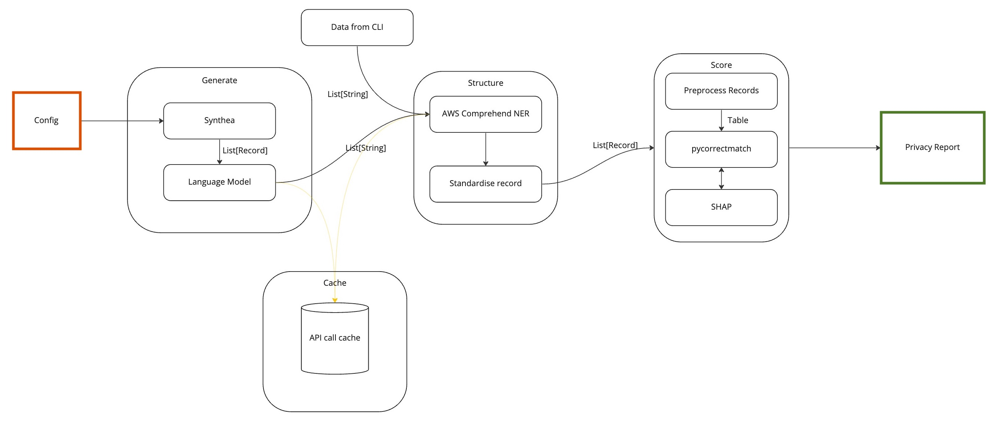

# Privacy Fingerprint (PrivFp) - Proof of Concept
## NHS England Digitial Analytics and Research Team

### :warning: Warning to Users :warning:

**This codebase is a proof of concept and should only be used for demonstration purposes within a controlled environment. The components are not a live product and should not be deployed in a live or production environment.**

### About the Project

[](https://github.com/GIScience/badges#experimental)
[](https://github.com/psf/black)
[](https://github.com/nhsengland/privfp-poc/actions/workflows/ci-pipeline.yml)

This repository holds code for Privacy Fingerprint (PrivFp), a proof of concept modular tool to provide a privacy risk score to healthcare free-text data.  The project was delivered between January and March 2023 by a commission delivered as part of the [Accelerated Capability Environment (ACE)](https://www.gov.uk/government/groups/accelerated-capability-environment-ace).

_**Note:** Only public or fake data are shared in this repository._

Evaluation and Limitations of Phase One of the project can be found in the [reports folder - README.md](./reports/README.md)

#### Intended Use

Two main use cases are expected:

##### Assessing a dataset

Given a data set of unstructured text the tool can be run via a command line interface. Instructions are given below in the usage section. Each piece of text is processed by the named entity recogniser to extract identifiers and then the global privacy risk score, individual record privacy risk score, and the contribution of different identifiers both globally and for each record are calculated.

##### Evaluating tool performance 

The performance of the tool has been investigated using generated short form clinical notes. Prior to using the tool on a different type of unstructured text it may be beneficial to generate a dummy dataset that closely matches the intended target and evaluate the performance again. This evaluation can then act as a quality assurance step for the assessment.

### Project Structure

The main sections of this repository are:

    .
    ├── configs                   # Compiled files (alternatively `dist`)
    ├── notebooks                 # Documentation files (alternatively `doc`)
    ├── src/privacy_fingerprint   # Source files
    │   ├── common                # Shared components such as config and cache
    │   ├── explain               # Split privacy risk score into identifier contributions
    │   ├── extract               # Apply Amazon Comprehend Medical to extract identifiers (NER)
    │   ├── generate              # Generate dummy data
    │   │   ├── synthea           # Generate structured dummy data
    │   │   └── language_model    # Convert structured records to unstructured text
    │   └── score                 # Privacy risk scoring module
    ├── reports                   # Contains description and results from PoC
    ├── tests                     # Automated tests (run with pytest)
    └── README.md

The diagram below illustrates how these modules can be used in combination.



### Getting Started

#### Installation

Assuming you have set up SSH credentials with this repository the package can be installed from Github directly by running:
```shell
python -m pip install git+ssh://git@github.com:nhsx/pvt-privacy-fingerprint.git
```

The package was developed and tested for [](https://www.python.org/downloads/release/python-390/)

**Note this project has several non-Python dependencies that must be installed before it will work.**

#### Dependencies

##### Julia and CorrectMatch

Julia and CorrectMatch are needed for both assessing a dataset and evaluating tool performance.

Privacy evaluation uses pycorrectmatch that relies on the [CorrectMatch](https://github.com/computationalprivacy/CorrectMatch.jl) package written for the Julia programming language.

To install [Julia](https://julialang.org/), find the link for the latest stable release on the download page. It can then be installed with:

```
wget https://julialang-s3.julialang.org/bin/linux/x64/1.8/julia-1.8.5-linux-x86_64.tar.gz
```

It can then be uncompressed with:

```
tar zxvf julia-1.8.5-linux-x86_64.tar.gz
```

Finally, the julia executable must be added to the PATH environment variable.

```
export PATH="$PATH:/path/to/julia-1.8.5/bin"
```
As Julia needs to be on the path whenever running this tool making the path change above more persistent may be beneficial. This can be done by adding the line to your `./profile` file.

The [CorrectMatch package](https://github.com/computationalprivacy/CorrectMatch.jl) can then be installed from within Julia:

```
julia -e 'using Pkg; Pkg.add("CorrectMatch")'
```


##### Synthea

Synthea is only needed if evaluating the tool performance as it is used to generate structured dummy records.

Evaluation of the tool requires [Synthea](https://github.com/synthetichealth/synthea) to be available. By default Synthea generates dummy data appropriate for the USA. Some modifications for a UK population are possible using the [Synthea-international](https://github.com/synthetichealth/synthea-international) repository.

To start, install Java:
```
sudo apt install openjdk-17-jdk
```
Earlier versions of Java failed during testing.

Clone both Synthea and Synthea-international:
```
git clone https://github.com/synthetichealth/synthea.git
git clone https://github.com/synthetichealth/synthea-international.git
```

There have been breaking changes between Synthea and Synthea International. To change to versions known to be compatible:

```
cd synthea
git checkout fb43d3957762465211e70daeeb2bc00e0dbd1c1d
cd ../synthea-international
git checkout b4cd9a30f106957ae8f2682090d45b04a49a7c4b
cd ..
```

If desired, the installation of Synthea can be checked:
```
cd synthea
./gradlew build check test
```
Copy the customisations from synthea-international to synthea:
```
cd synthea-international
cp -R gb/* ../synthea
cd ../synthea
```
After copying across the internationalization changes the original test suite will fail if run again. This is an expected behaviour due to the modified outputs.

The installation location of Synthea is required to run the tool and should be copied into the config file.

### Usage

The privacy fingerprinting tool can be used as a command line interface and via notebooks. 

### Command line interface

A command-line interface (CLI) is provided to run end-to-end assessment of a provided dataset. Provided a dataset of free-text clinical records as a text file with one record per line:


```
,clinical_note
0,"this is the first clinical record"
1,"this second clinical note
spans two lines"
2,"this is the third clinical note"
3,"this note contains ""quotation marks"" that are escaped"
...
```

Quotation marks enable notes to span multiple lines. If a note itself contains quotation marks these are doubled up to escape them.

Once the package has been installed, the tool can be run using:
```shell
privacy-fingerprint GLOBAL_CONFIG assess [OPTIONS] EXPERIMENT_CONFIG DATA_PATH RESULTS_DIRECTORY
```

and more information can be found by running:
```
privacy-fingerprint GLOBAL_CONFIG assess --help

Usage: privacy-fingerprint GLOBAL_CONFIG assess [OPTIONS] EXPERIMENT_CONFIG
DATA_PATH RESULTS_DIRECTORY

Display the privacy risk for the dataset contained in DATA_PATH.

EXPERIMENT_CONFIG contains configuration information that is specific to a
single run of the tool

DATA_PATH is the data to be analysed and should be a csv file with a single
column

RESULTS_DIRECTORY will be used to save all results

Options:
--explain / --no-explain  Explain privacy risk scores using SHAP
--help                    Show this message and exit.

```

A full list of commands is displayed by running:
```
privacy-fingerprint --help
Usage: privacy-fingerprint [OPTIONS] GLOBAL_CONFIG COMMAND [ARGS]...

Interact with the privacy fingerprint risk scoring package

GLOBAL_CONFIG contains configuration information shared across multiple runs

Options:
--help  Show this message and exit.

Commands:
assess  Display the privacy risk for the dataset contained in DATA_PATH.

```

#### Pipeline Results and Outputs

The `RESULTS_DIRECTORY` specified when running the CLI will contain the generated data from each step of the process:

* A copy of the experiment configuration
* A log file
* The raw Amazon Comprehend Medical (NER) results
* The processed NER records
* The dataset used for scoring with pycorrectmatch
* The individual privacy risk scores for each record
* If requested, the individual explainability
* If requested, the global explainability

### Notebooks

The notebooks directory includes several examples of how to use the different modules of the tool and how to evaluate tool performance.

### Configuration

Two configuration files are used to organise settings and an example of each is included in the `configs` directory.

A global configuration file contains settings that are common across multiple runs of the tool. This includes API keys and the location of the caching database file.

If using environment variables is preferred for storing API keys this is also supported. In the config file the openai API key is located in openai.api_key and can be replaced by an environment variable that is prefixed by `PRIVACY_FINGERPRINT__` and in which the period is replaced by a double underscore, i.e. `PRIVACY_FINGERPRINT__OPENAI__API_KEY`.

An experiment configuration file contains settings that are specific to a single run of the tool. The file is organised by the steps in the pathway. If running the tool on a dataset, the scoring section is most relevant. There are two settings:

* `encoding_scheme` can be set to `one-hot` to break different diseases, symptoms, etc into individual columns and `rarest` that takes the rarest value for each record. It is recommened that `rarest` be used as this requires a smaller number of columns and run time increases significantly with the number of columns.
* `max_columns` restricts the number of columns that are generated when using the `one-hot` encoding scheme. If `one-hot` must be used it is recommended to experiment with the smallest number of columns necessary. When testing performance, both the fit and predict methods should be evaluated.

### Roadmap

See the [Issues](https://github.com/nhsengland/privfp-poc/issues) for a list of proposed features (and known issues).

### Contributing

Contributions are what make the open source community such an amazing place to learn, inspire, and create. Any contributions you make are **greatly appreciated**.

1. Fork the Project
2. Create your Feature Branch (`git checkout -b feature/AmazingFeature`)
3. Commit your Changes (`git commit -m 'Add some AmazingFeature'`)
4. Push to the Branch (`git push origin feature/AmazingFeature`)
5. Open a Pull Request

_See [CONTRIBUTING.md](./CONTRIBUTING.md) for detailed guidance._

### License

Unless stated otherwise, the codebase is released under [the MIT Licence][mit].
This covers both the codebase and any sample code in the documentation.

_See [LICENSE](./LICENSE) for more information._

The documentation is [© Crown copyright][copyright] and available under the terms
of the [Open Government 3.0][ogl] licence.

[mit]: LICENCE
[copyright]: http://www.nationalarchives.gov.uk/information-management/re-using-public-sector-information/uk-government-licensing-framework/crown-copyright/
[ogl]: http://www.nationalarchives.gov.uk/doc/open-government-licence/version/3/

### Contact

To find out more about the [Digitial Analytics and Research Team](https://www.nhsx.nhs.uk/key-tools-and-info/nhsx-analytics-unit/) visit our [project website](https://nhsx.github.io/AnalyticsUnit/projects.html) or get in touch at [analytics-unit@nhsx.nhs.uk](mailto:analytics-unit@nhsx.nhs.uk).

<!-- ### Acknowledgements -->

