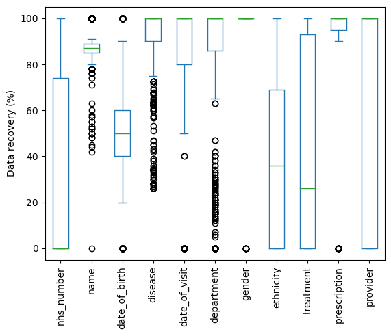
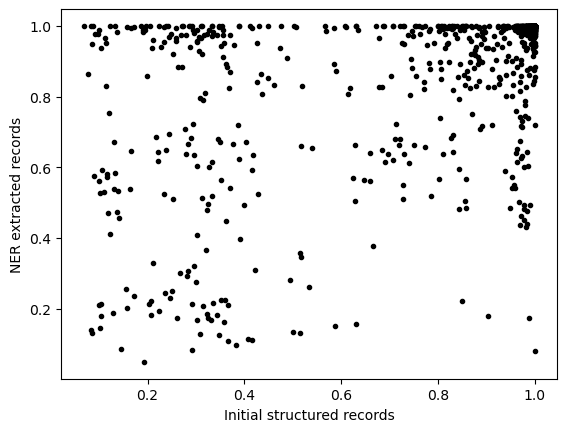
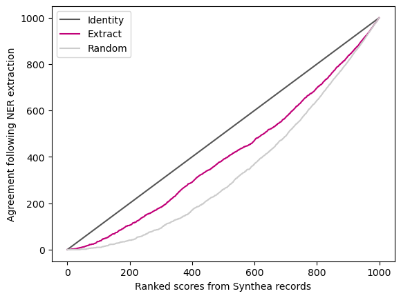
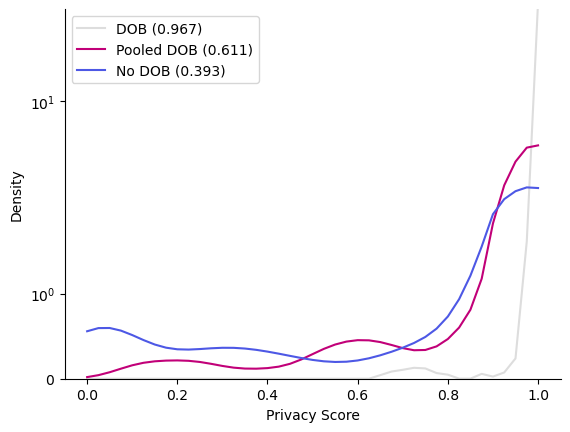

# Privacy Fingerprint Proof of Concept (PrivFp PoC) Phase One - Evaluation and Limitations

The development and deployment of AI within the NHS can benefit a variety of purposes that range from medical research to operational intelligence. Developing AI systems requires sharing information creating a tension between utility and the need to preserve the privacy of data subjects. Evaluating the privacy risks of data sharing is largely a manual task and would benefit from an automated tool to assess the risks in a standardised way and generate a clear audit trail of the de-identfiication steps that have been taken and the impact these have had on the data set.

Ensuring that individuals cannot be identified in a shared dataset goes beyond NHS number, name, or date of birth to include complex interactions between identifiers that alone would be insufficient to identify an individual. To handle such interactions, a statistical model is used to generate a score that is equivalent to "likelihood of successful re-identification".

By evaluating a dataset using this tool the relative risks of different types of identifiers and the relative risks for different records can be understood and used to apply mitigations to preserve privacy whilst maximising utility.

The challenges around preserving privacy are exacerbated when the dataset contains unstructured information such as clinical notes and patient feedback. To address this use case, unstructured text is first passed through a named entity recognition step to extract potential identifiers. As leakage at this step could compromise the accuracy of the privacy risk score, dummy structured records were created with known identifiers and then using a large language model converted to unstructured text for evaluation of the tool. The results of this analysis are shown below and can be re-run using the notebooks.

## Evaluation

#### Interpretation of Pycorrectmatch results

Pycorrectmatch is based on a generative copula-based method. The model first extracts empirical marginal distributions (Ψ) and a correlation matrix (Σ) from a given dataset and uses them to fit a statistical model for multivariate distributions, a Gaussian Copula. For any individual not necessarily in the training sample, the model then computes the individual uniqueness (and correctness of re-identification) given the parameters (Σ, Ψ) and the individual’s attributes (𝑥) using multivariate integration.

The model estimates the population uniqueness, which is the fraction of unique records in the dataset, and individual uniqueness, which is the expected probability to draw a record x matching the individual’s attributes in the complete population.

The calculation of the individual uniqueness is based on the marginals and the covariance matrix of the fitted model. This has the limitation that frequent identifiers that appear in a rare combination will not be captured by the individual uniqueness. However, their existence is quantified in the population uniqueness score.

### Pipeline data changes

The accuracy of the privacy risk score is limited by the ability of the NER (Amazon Comprehend Medical) to extract all relevant identifiers and then presenting those identifiers in a lossless way for analysis by pycorrectmatch. To understand this accuracy dummy data is generated by Synthea and used to generate unstructured text using the large language model. In this way, we can know the ground truth for each record. The differences between this known starting point and the resulting record after NER can then be analysed.

In the plot above the recovery of each identifier across a dataset of 1000 records is presented. Performance was variable with causes including:

* Parts of identifiers being missed (e.g. NHS number and name)
* Confusion between identifiers (e.g. date of birth and date of visit)
* Erroneous categorisation (e.g. disease and treatment)

These errors alter the privacy risk scores observed.

The plot above shows the correlation between privacy risk scores calculated on the original Synthea structured records and the extracted records after LLM and NER. The correlation was 0.535.

This plot compares the rank of scores generated from the Synthea records (x-axis) and the extracted records (y-axis). Ideally, the ranking for each would match and this is shown by the identity line. Shown is light grey is no relationship between the two scores generated by randomly shuffling the scores. In magenta is the observed relationship between the Synthea records and the extracted records.

### Impact of de-identification on privacy risk score

An important use case for the tool is understanding the impact on privacy of de-identification decisions. Using a dataset of 1000 records the population uniqueness was calculated after making several changes aimed at preserving utility while maximising privacy.

|               | 0   | 1   | 2   | 3     | 4     | 5     | 6    | 7    | 8    |
|:--------------|:----|:----|:----|:------|:------|:------|:-----|:-----|:-----|
| nhs_number    | X   |     |     |       |       |       |      |      |      |
| name          | X   | X   |     |       |       |       |      |      |      |
| date_of_birth | X   | X   | X   |       |       | X     | X    | X    |      |
| date_of_visit | X   | X   | X   |       |       |       |      |      |      |
| department    | X   | X   | X   | X     |       |       |      |      |      |
| gender        | X   | X   | X   |       |       |       | X    | X    | X    |
| ethnicity     | X   | X   | X   |       |       |       |      | X    | X    |
| provider      | X   | X   | X   | X     |       |       |      |      |      |
| disease       | X   | X   | X   | X     | X     | X     | X    | X    | X    |
| symptoms      | X   | X   | X   | X     | X     | X     | X    | X    | X    |
| treatment     | X   | X   | X   | X     | X     | X     | X    | X    | X    |
| prescriptions | X   | X   | X   | X     | X     | X     | X    | X    | X    |
| SCORE         | 1.0 | 1.0 | 1.0 | 0.866 | 0.211 | 0.924 | 0.95 | 0.98 | 0.55 |

The table above illustrates the impact of including a limited set of identifiers, indicated by an `X`. Including only disease, symptoms, treatment, and prescriptions brings the score down from 1.0 to just 0.211. This does lose some information that might be important such as gender, ethnicity and date of birth.

|               | 0        | 1        | 2        |
|:--------------|:---------|:---------|:---------|
| nhs_number    |          |          |          |
| name          |          |          |          |
| date_of_birth | X        | simplify |          |
| date_of_visit |          |          |          |
| department    |          |          |          |
| gender        | simplify | simplify | simplify |
| ethnicity     | simplify | simplify | simplify |
| provider      |          |          |          |
| disease       | X        | X        | X        |
| symptoms      | X        | X        | X        |
| treatment     | X        | X        | X        |
| prescriptions | X        | X        | X        |
| SCORE         | 0.967    | 0.611    | 0.393    |

In this second table, more subtle alterations are considered. By grouping date of birth, gender and ethnicity into larger groups privacy can be enhanced while maintaining greater utility. Contrast the first column (0.967) with the second (0.611) or the last column in the first table (0.55) with the last column in this table (0.393).

The effect of de-identifications can also be seen in the individual record level privacy risk scores.

In the plot above, the distribution of scores shifts to lower values as the date of birth is first pooled and then deleted.

## Limitations

The limitations of this package can be categorised based on component or identifier.

### Components

The external dependencies place some limitations on the overall solution.

#### Synthea

Synthea was originally developed for the US. There are some customisations for the UK but it still uses US demographic data. The records generated are in clinical settings only and the care received by the simulated patients follows clinical care guidelines. Some record types are not generated and those that are may miss more unusual cases.

#### OpenAI Davinci large language model

This model has been able to generate unstructured text in a reasonable approximation of a clinical note. Some experimentation with the prompt is needed to generate the best outputs. Some variation is seen even when using the same prompt which is useful for generalisability but some identifiers can be omitted.

#### Amazon Medical Comprehend

The NER service has performed reasonably well when language is consistent with the US but can struggle with UK specific text such as NHS number and addresses.

#### pycorrectmatch

A constraint of pycorrectmatch is the requirement for tabular categorical data. This presents some complications when identifiers can have several values in the same record. The choice of how to encode multiple identifiers (e.g. multiple diseases, symptoms, treatments, etc) becomes important and can alter the performance. Pycorrectmatch slows down significantly as the number of columns increases forcing the encoding to remain compact with the risk of losing information.

The privacy risk scores are only valid with the following assumptions hold:

* The rows (records) are independent and identically distributed
* The data are uniformly sampled from the population
* In our implementation we have made the additional assumption that all marginals come from categorical (count) distributions to facilitate calculations. Other options of the model are negative binomials and logarithmic distributions.

Although not supported currently, two approaches exist to relaxing these constraints:

* Existing sampling bias can be overcome by training on a random sample from the population and then applying the trained model to the non-uniform sample.
* Exogenous information can be used to estimate marginals with higher accuracy (such as postcodes from national surveys)

#### Explainability (SHAP)

Unlike many machine learning models in pycorrectmatch the scoring step can take as long or longer than the initial model fitting. As additional examples must be processed for SHAP to calculate the contribution from each identifier in each record the run time of explainability can become substantial.

### Identifiers

Identifiers are extracted from the clinical notes and form the basis for the privacy risk score.

| Identifier | Type | Limitations |
| ---------- | ---- | ----------- |
| NHS number | Unique | Partial extractions and confusion with telephone numbers |
| Name | Direct | Given name can be missed and patient and doctor can be confused |
| Date of birth | Direct | Confusion if multiple dates exist in the note |
| Disease | Indirect | Different approaches to encoding multiple diseases. Some erroneous results detected such as full-time employment |
| Symptoms | Indirect | Different approaches to encoding multiple symptoms |
| Date of visit | Indirect | Confusion if multiple dates exist in the note |
| Department | Indirect | Limited support by Amazon Comprehend Medical |
| Stated gender | Indirect | Reliably picked up by Amazon Comprehend Medical with some notable exceptions, such as names and ethnicities |
| Ethnicity | Indirect | Good support for US ethnic groups but does not generalise well to UK and some unexpected errors such as names |
| Treatment | Indirect | Different approaches to encoding multiple treatments |
| Prescriptions | Indirect | Amazon Comprehend Medical performs well but only limited testing on UK brand names and can struggle on combinations |
| Hospital | Indirect | Good support for hospitals, surgeries, etc but can struggle on UK addresses |

